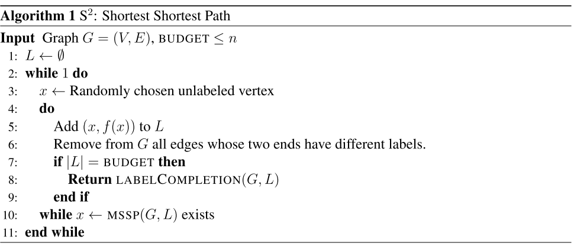
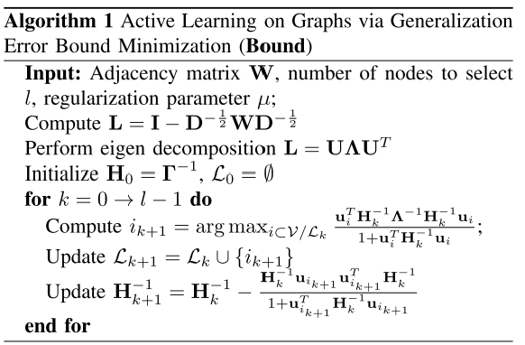
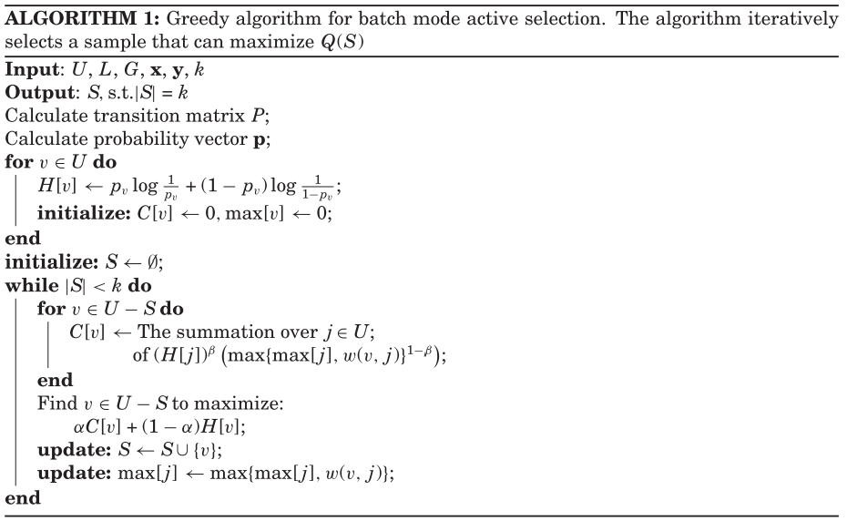

## Active GNN reading notes

---

### [S2: An efficient graph based active learning algorithm with application to nonparametric classification](https://arxiv.org/pdf/1506.08760.pdf)
- Problem setup
  - active learning for binary label prediction on a graph
  - nonparametric active learning, S2 sequentially select vertices to be labeled
    - *cut-set*:  $C = \{\{x, y\}\in E : f(x) \neq f(y)\}$
      
    - *boundary*: $\partial C = \{x\in V:\exist e\in C \text{  with } x\in e\}$ goal is to identify $\partial C$
      
        
    - algorithm assume a noiseless oracle that return label of a multiset of vertices, noisy oracle version algorithms can be transferred from noiseless
    - can be extended to multi-class
- Datasets
  - Digits:
    - Cedar Buffalo binary digits database
    - construct symmetrized 10-nearest-neighbor graph
  - Congressional Voting Records (CVR):
    - 380 vertices, boundary size of 234
  - Grid:
    - synthetic example of a 15x15, positive core in the center
- Methods
    - S2: Shortest Shortest Path 
      - LABELCOMPLETION: Any off-the-shelf graph prediction algorithms
      - **MSSP**: return midpoint on the shortest among all the shortest-paths that connect oppositely labeled vertices in L
    - Can be seen as: random sampling + aggressive search
      - aggressive search: like binary search to find the cut-edge, then unzip the cut-edge
- Baselines
    - measure query complexity
    - AFS [On the complexity of finding an unknown cut via vertex queries](https://dl.acm.org/doi/abs/10.5555/2394650.2394695)
    - ZLG [Combining active learning and semi- supervised learning using Gaussian fields and harmonic functions](http://mlg.eng.cam.ac.uk/zoubin/papers/zglactive.pdf)
    - BND [Towards active learning on graphs: An error bound minimization approach](http://web.cs.ucla.edu/%7Eqgu/pdf/icdm12.pdf)

---
### [Active Learning for Networked Data](https://icml.cc/Conferences/2010/papers/544.pdf)
- Problem setup
  - classifying nodes (labels prediction)
    - node features
    - graph structure
    - features/labels of neighbor nodes
  - collective classification:
    - simultaneously predicting labels of all nodes
  - active learning
    - request labels, with goals of decreasing number of labels needed
    - pool-based setting: 
      - initially provided with pool of unlabeled examples
      - each step select batch of instances, remove from pool, add to labeled corpus
    - task:
      - collective classification as base learner
      - train: active learning learn CC, CO
      - test: ICA + CC
  
- Methods
  1. cluster nodes based on graph structure: modularity clustering
  2. iterate:
     1.  re-train CO, CC
     2.  score clusters based on CO/CC disagreement, pick top k clusters
     3.  label one of unlabeled node from each of the k clusters, remove them from pool
         - the node with greatest disagreement LD between CO, CC, majority is picked

       4. Semi-supervision and Dimensionality reduction
          1. semi-supervised collective classification method, use CO to predict unobserved neighbor
          2. PCA
   - note: 
     - CC: $P(Y_i|X_i, \text{aggr}(N_i))$, consider neighbor labels
     -  CO: $P(Y_i|X_i)$ local classifier with only node features
- Datasets
  - [Cora & CiteSeer](http://www.cs.umd.edu/projects/linqs/projects/lbc/)
    - citation network
    - ignore directions
    - cleaned up
- Baselines
  1. Semi-supervision and Dimensionality Reduction (Base Learner)
     1. CO
     2. CC
     3. CC+Semi-supervision
     4. CC+Semi-supervision+PCA

  2. ALFNET
     1. Random
     2. Uncertainty sampling

  3. Ablation
     1. disagreement: no cluster structure
     2. clustering: select cluster randomly

---

### [Active Discriminative Network Representation Learning](https://www.ijcai.org/Proceedings/2018/0296.pdf)
- Problem setup
  - a network representation learning method under active learning principle
  - pool-based active learning setting, select most informative instance given **query strategy**
  - Then label the selected node, add to labeled set for network representation learning

- Method
  - AL **Query Strategy**
    - uncertainty measure:
      - **Information Entropy**: prediction from node embedding
    - representativeness measure:
      - **Node centrality**: PageRank centrality
      - **Information density**: K-means on node embedding
  - Active Node Selection
    - Multi-Armed Bandit Method
    - Reward Scheme
  - Active Discriminative Network Representation
    - GCN

- Datasets
  - Citeseer, Cora, Pubmed
    - sparse BOW feature vector for each document
    - citation links

- Baselines
  - GCN: randomly select node
  - AGE: linearly combination of AL query strategy
  - ANRMAB-exclude:
    - ANRMAB-entropy
    - ANRMAB-centrality
    - ANRMAB- density
  - Metrics:
    - Macro-F1
    - Micro-F1

---

### [Towards Active Learning on Graphs: An Error Bound Minimization Approach Quanquan](http://web.cs.ucla.edu/%7Eqgu/pdf/icdm12.pdf)
- Problem setup:
  - adaptive method
  - non-adaptive method: this paper developed
    - present data-dependent generalization error bound for LLGC, using transductive Rademacher Complexity
    - actively select nodes by minimizing the empirical transductive Rademacher complexity of LLGC on a graph
    - present sequential optimization algorithm to select labeled data
    - use LLGC as classfier on labeled data

- Method:
  - LLGC:
    - graph-based(semi-supervised) learning method
    - add Graph Regrlarization

  - Objective function (for selection):
    - expected error on unlabeled <= empirical error on the labeled data + empirical transductive Rademacher complexity + confidence term
    - non-adaptive, do not know empirical error on the labeled data until label nodes
    - only minimize empirical transductive Rademacher complexity for LLGC

  - Sequential optimization
    - sequentially select nodes to be labeled is to optimize the above objective.
    - 

  - Learning pipline:
    - select nodes by active learning
    - train classifier(LLGC) on the graph

- Datesets
  - Cora
    - 2 datasets from DS, PL
    - largest connected component is used
    - undirected

  - Coauthor
    - from DBLP
    - author as nodes, weighted edge by papers co-authored

- Baselines
  - active learning:
    - Random
    - [Variance Minimization (VM)](http://citeseerx.ist.psu.edu/viewdoc/download?doi=10.1.1.417.4428&rep=rep1&type=pdf)
    - [METIS](https://papers.nips.cc/paper/3752-label-selection-on-graphs.pdf)
    - [Ψ Maximization (Ψ-Max)](https://arxiv.org/abs/1202.3726)
    - BOUND: Proposed
  - classifier:
    - LLGC: Proposed
    - GFHF: used in VM
    - MinCut: used in Ψ-Max

---

### [Active Learning on Graphs via Spanning Trees](http://citeseerx.ist.psu.edu/viewdoc/download?doi=10.1.1.392.6927&rep=rep1&type=pdf)
- Problem setup:
  - node classification, focus on prediction that rely on network topology only
  - homophily bias: linked entities tend to have same class-->clusters

- Method:
  - define: 
    - cutsize $\Phi(y)$: number of edges connecting nodes with different labels
    - function $\Psi^*(L)$: small value correspond to good choice of traninig nodes $L$ that satisfy homophily
    - Together bound from above the number of mistakes on non-training nodes

  - approach:
    - use [SEL](https://arxiv.org/abs/1301.5112) to minimize $\Psi^*$ on a spanning tree of graph
    - [label propagation](http://www.iro.umontreal.ca/~lisa/pointeurs/bengio_ssl.pdf) on entire graph, yields a fast classifier that is better than random selection

- Datasets
  - RCV1 corpus
    - build weighted graph using k-NN
  - DBLP network
  - CORA network

- Baselines
  - Spanning trees generation:
    - RST(Random)
    - BFST(Breadth-first)

  - random selection
  - high-degree

---
### [Bayesian Semi-supervised Learning with Graph Gaussian Processes](https://papers.nips.cc/paper/7440-bayesian-semi-supervised-learning-with-graph-gaussian-processes.pdf)

- Problem setup:
  - graph-based semi-supervised learning: relational graph of data points is available
  - propose **Gaussian process model**, **scalable variational** inducing approximation method to perform **inference**
  - review:
    - Gaussian Process
      - **priors** on functions in Bayesian Inference

    - Scalable Variational Inference for GP
    - Graph Laplacian
      - $$\textbf{L} = \textbf{D} - \textbf{A}$$
      - Graph Laplacian can be viewed as operator on space of functions $g: V \to \R$
        $$\textbf{L}(g) = \sum_{v \in Ne(n)}[g(n)-g(v)]$$

- Method
  - Graph Gaussian Process
  - Variational Inference with Inducing Points
  - Active learning:
    - GGP as classification model paired with [Σ- optimal (SOPT)](https://www.cs.cmu.edu/~schneide/nips13ma.pdf) to form active learner, select + retrain classifier for 50 times

- Datasets
  - Cora, Citeseer, Pubmed
- Baselines
  - semi-supervised settings
    - GCN, MoNet, DCNN, DeepWalk, Planetoid, ICA, LP, SemiEmb, ManiReg

  - Active learning setting:
    - SOPT+GCN/LP
    - RAND+GGP/GCN/LP

---
### [Batch Mode Active Learning for Networked Data](https://people.csail.mit.edu/lixin/files/tist.pdf)
- Problem setup
  - Batch mode active learning
    - query $k$ labels of instances $S$ to improve quality of learned classification model
    - define an objective function for active selection $Q$
    - design efficient algorithms to maximize $Q(S)$
  - selection combine both context and link information
  - present objective function based on maximum uncertainty, maximum impact, and minimum redundancy
  - Underlying model: Framework of Random Walk

- Method
  - Objective function $Q(S)$: combine maximum uncertainty and the maximum impact, naturally satisfy minimum redundancy
  - Use Framework of Random Walk as classification model
  - Combining **Link Information**: integrate link information into **similarity matrix**, extend similarity measure with **Pagerank**
  - Optimization: Greedy selection, monitonic submodular, have good error bound

  - Speed up with parallel algorithm

- Datasets
  - Gaussian Synthetic Dataset
    - random generated, 17 Gaussian distributions
    - no link information
    - use KNN to learn classification model
  - The Networked Synthetic Dataset
    - without content information
  - Real world with links:
    - Cora, Citeseer, WebKB
    - cast as multiple binary
  - Real World without Links:
    - UCI 20 Newsgroup
classification tasks
- Baselines
  - Real world with links
    - Random
    - Most Uncertainty: largest entropy
    - Active Learning Using Gaussian Fields
    - Hybrid
    - k-means
  - Real world without links
    - Random
    - Most Uncertainty: largest entropy
    - Active Learning Using Gaussian Fields
    - SVM
    - Fisher
  - On Gaussian Synthetic Dataset:
    - Maximum Uncertainty
    - Without Maximum Uncertainty
    - Without Minimum Redundancy

---

### [FEW-SHOT LEARNING ON GRAPHS VIA SUPER- CLASSES BASED ON GRAPH SPECTRAL MEASURES](https://openreview.net/forum?id=Bkeeca4Kvr)

- Problem setup:
  - few-shot setting:
    - training: classifier must generalize well after seeing abundant base-class samples
    - testing: very few samples from novel class
  - Details
    - training: set of *base class* labeled graphs $G_B = \{(g_i^{(B)}, y_i^{(B)})\}_{i=1}^n$, set of *novel class* labeled graphs $G_N = \{(g_i^{(N)}, y_i^{(N)})\}_{i=1}^m$ used for fine-tuning, where $m<<n$, set of labels from base class graphs and novel class graphs are disjoint.
    - testing: set of ublabeled unseen graphs $G_U = \{g_i^{(U)}\}_{i=1}^t$

- Method:
  - Computing super classes
    - Prototype Graphs: 
      - partitioned $G_B$ according to graph labels, $G_B = \cup_{i = 1}^K G^{(i)}$
      - pick prototype graph $p_i$ for the i-th class with least average spectral distance to rest graphs in the same class
    - Clustering prototype graphs:
      - $k$-means
      - into $k$ super classes
  - GNN
    - GIN as graph feature extractor
  - Classifier
    - build super-graph:
      - node is graph feature vector
      - build on a batch of *base-labeled* graphs as a collection of k-NN graphs
      - each constituent k-NN graph is built on the graphs belonging to the same super-class
    - super graph passed through multi-layered graph attention network GAT
    - graph embedding passed into MLP to learn associated super-class labels
    - add cross-entropy losses associated with GAT and MLP
  - fine-tune:
    - fix GIN, MLP, tune GAT
- Datasets:
  - Letter-High, TRIANGLES, Reddit-12K, and ENZYMES.
- Baselines:
  - k-NN search on embeddings
    - Supervised:
      - GIN, CapsGNN, Diffpool
    - Unsupervised:
      - AWE, Graph2Vec, Weisfeiler- Lehman subtree Kernel, Graphlet count kernel
  - Few-shot:
    - replace GAT with GCN
    - replace classifier with k-NN: GIN-k-NN

---

